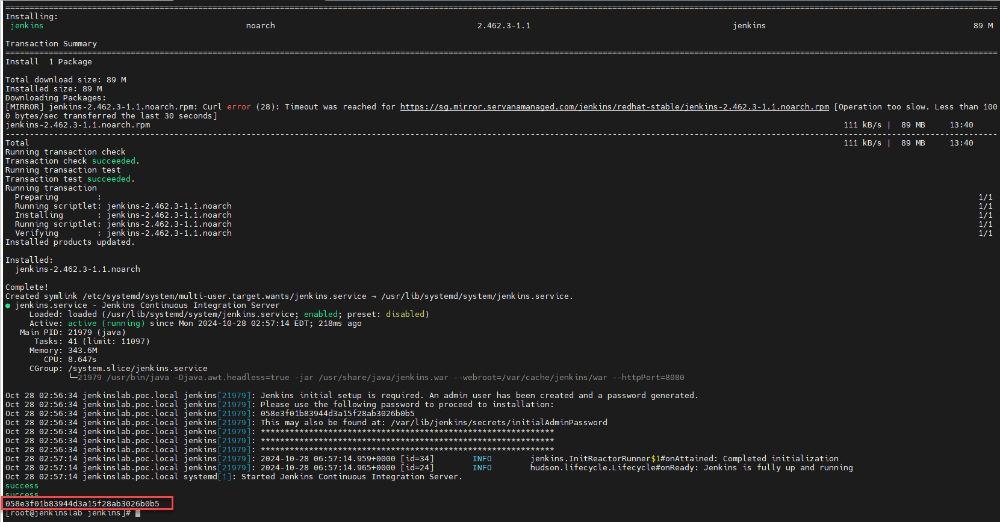

I. Cài đặt và cấu hình Jenkins
    1. OS requirment :
    Redhat 9.4 or later
    RAM : 4GB
    CPU : 2 cores
    2.Cài đặt Jenkins
        -  SSH vào server sẽ cài đặt jenkins bằng user root. Sử dụng lệnh sau để tạo folder và tải  file cài đặt:
            sudo mkdir /opt/Jenkins
            cd /opt/Jenkins
            sudo yum install git -y
            git clone https://github.com/trungduongmewmew/Jenkins_Conjur.git  
            cd Jenkins_Conjur/Install_Jenkins/  
        -  Cấp quyền thực thi cho các file .sh trong thư mục bằng lệnh sau :  
            sudo chmod +x *.sh  
        -  Chạy file 01_Install_Jenkins.sh để tiến hành cài đặt Jenkins.Sau khi chạy xong script , copy lại chuỗi cuối cùng để làm passcode đăng nhập user admin vào Jenkins  
          
        
